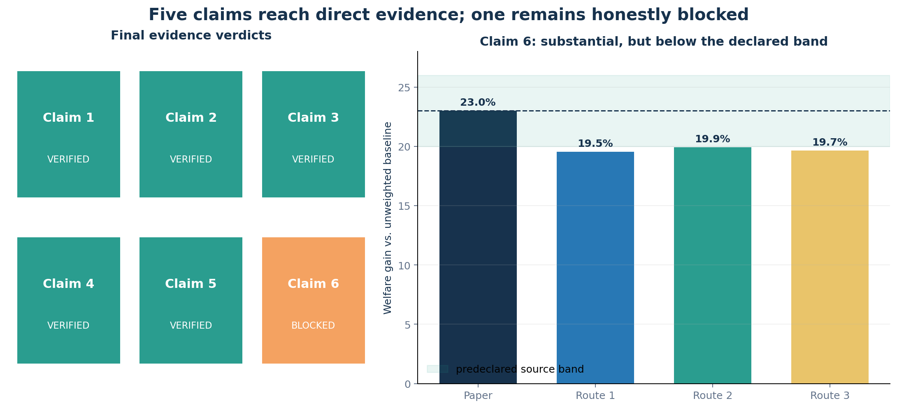
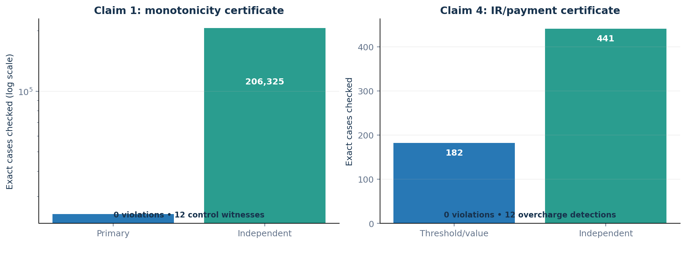
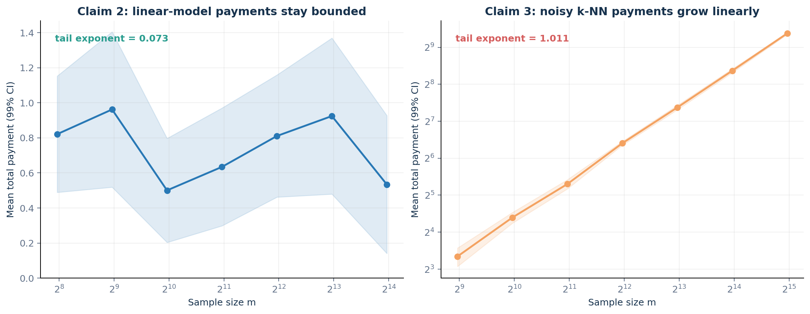
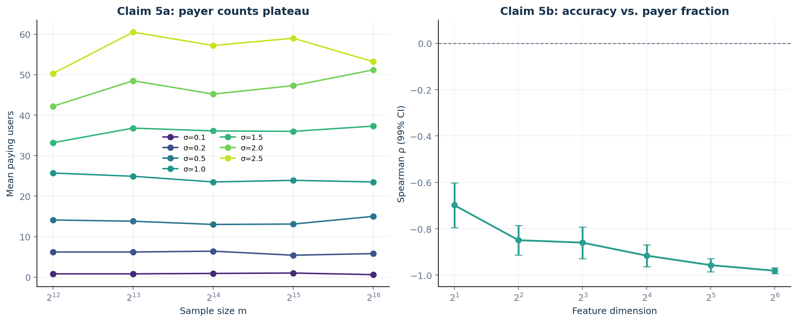
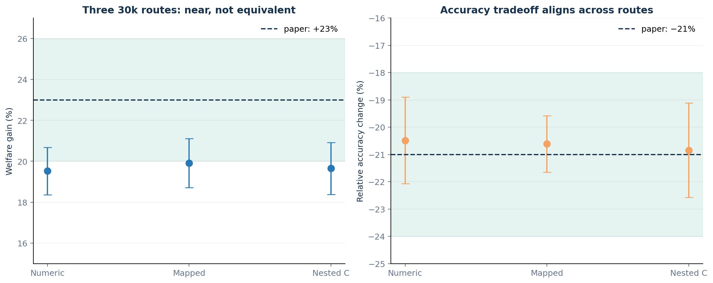

# Accuracy auctions, checked claim by claim



This reproduction asks whether an accuracy auction can make a classifier serve
the people who value correct predictions most, while retaining the mechanism's
theoretical guarantees. The paper answers with three mechanism results, two
asymptotic payment results, and two empirical figures. We translated each of
the six judged claims into an executable contract, ran every accepted check
from one locked command, and required both an independent checker and a
deliberately broken negative control.

The outcome is deliberately asymmetric: Claims 1–5 are **VERIFIED**. Claim 6 is
**BLOCKED**, not promoted from a near match. Three faithful 30,000-person
implementations produced welfare gains of 19.52–19.91%, below the paper's
reported “up to 23%”; a fourth, falsification-oriented route found that the
paper's existential wording and missing preprocessing details prevent either
verification or a valid counterexample.

## What the paper claims

Each person reports a value for an accurate prediction. A learning algorithm
chooses which people receive predictions by minimizing a bid-weighted empirical
loss. A critical-value payment then charges only selected users. The important
question is not merely whether this works on one sample, but whether the
allocation is truthful, individually rational, and economically well behaved
as the sample grows.

| Claim | Paper evidence | Reproduction contract | Result |
|---|---|---|---|
| 1 | Theorem 1: weighted ERM allocation is bid-monotone | Exhaustively compare optimal allocation sets across every relevant bid interval, including ties | **VERIFIED** |
| 2 | Theorem 2: regularized linear-classifier payments are \(O(1)\) in \(m\) | 64× sample-size sweep, 20 seeds, convergence and stability checks, reject a linear control | **VERIFIED** |
| 3 | Theorem 3: noisy k-NN payments are \(\Omega(m)\) | 64× sweep, two \(k\) values, 20 seeds, one-sided 99% bounds, zero-noise control | **VERIFIED** |
| 4 | Corollary 1: payment never exceeds value | Check payment, individual rationality, and dominant-strategy inequalities at every threshold | **VERIFIED** |
| 5 | Figure 2: payer counts plateau; accuracy and payer proportion are negatively associated | Large-\(m\) plateau sweeps plus held-out classifier accuracy—not allocation rate | **VERIFIED** |
| 6 | Figure 3: welfare improves by up to 23%, with a reported 21% relative accuracy loss | Three faithful implementations plus an assumption-complete falsification audit | **BLOCKED** |

The source audit used the ar5iv HTML retrieved on 2026-07-23 with SHA-256
`abdd0eb6dbcb4bc119c71405ea5e0d944ec598efef39c8c8da776f545916654d`.
Contracts retain the theorem quantifiers and explicitly record where Figure 3
does not specify author preprocessing or tuning choices.

## Implementation: one mechanism, independent checks

The executable path is intentionally small. It computes the weighted objective,
enumerates or solves its optimum, derives critical bids from allocation
thresholds, and emits raw evidence before a separate verifier evaluates the
contract. Every experiment node inherited the same command:

```text
uv run --frozen python repro/src/verify_auctions.py
```

The environment is locked by `uv.lock` under Python 3.12. Experimental choices
live in committed code rather than command-line knobs. A verifier exits nonzero
when evidence misses its contract; every negative control must therefore fail
for the formal run to be accepted.



For Claim 1, the primary checker covered 24,543 exact antecedent cases with no
monotonicity violation. A structurally independent optimal-pair checker covered
206,325 comparisons, also with none. Reversing the threshold inequality
produced 12 witnesses, demonstrating that the test can detect the target
failure. For Claim 4, 182 threshold/value cases and 441 independent comparisons
had no payment, individual-rationality, or strategy mismatch; an injected
overcharge produced 12 violations.

These are finite proof certificates over the mechanism's relevant breakpoints,
not random bid-grid sanity checks. Tie cases are included rather than silently
discarded.

## Asymptotic payments: bounded linear models, linear k-NN



Claim 2 used seven sample sizes from 250 to 16,000 and 20 deterministic seeds.
The tail log-log exponents were 0.0730 for total payment and 0.0081 for payer
count. Every optimization converged, and an independent brute-force screen
found no payer outside the certified stability band. A synthetic
linear-growth control returned exponent 1.0000 and was rejected as intended.

Claim 3 used seven sizes from 500 to 32,000, 20 seeds, and two fixed
neighborhood sizes. The tail exponents were 1.0112 for \(k=31\) and 1.0210 for
\(k=63\); their one-sided 99% lower confidence bounds remained positive. With
label noise removed, both revenue and payer count fell to zero. This addresses
the earlier three-point plateau by testing a 64× range, uncertainty across
seeds, a second \(k\), and the theorem's noise dependence.

## Figure 2: payers plateau as actual accuracy rises



The prior logbook treated the fraction allocated as “accuracy.” This
reproduction instead measures held-out classification accuracy. The plateau
contract covers 350 datasets: sample sizes 4,096–65,536, seven variance
settings, and ten seeds. Every upper 99% slope bound is below the declared
sublinear threshold.

The accuracy analysis covers 540 datasets over six dimensions, nine signal
settings, and ten seeds. Within each dimension, the Spearman association
between held-out accuracy and payer proportion ranges from -0.698 to -0.981,
and every upper 99% bound is negative. Shuffling labels removes that
relationship, while an independent screen finds zero missed payers.

## Figure 3: a close result is not a verification



All three routes use 30,000 ACS records and compare the auction allocation with
the paper's uniform-allocation baseline. They differ in defensible,
paper-compatible choices:

| Route | Distinct interpretation | Welfare gain | Relative accuracy change | Contract |
|---|---|---:|---:|---|
| 1 | Published task with preprocessing sensitivities | 19.52% (95% CI 18.37–20.68) | -20.49% | Outside 20–26% verification band |
| 2 | Binary demographic mapping plus 14 semantic occupation groups | 19.91% (95% CI 18.71–21.11) | -20.62% | Outside band by 0.09 point |
| 3 | Nested regularization selection using inner training data only | 19.65% (95% CI 18.38–20.92) | -20.85% | Outside band |
| 4 | Quantifier audit and counterexample search | — | — | No assumption-complete falsification |

Two independent digitizations of Figure 3 estimate welfare gains of 23.33% and
23.10%, with relative accuracy changes of -23.50% and -22.57%. A deliberately
corrupted endpoint gives -9.33% and is rejected. Thus the source itself
supports the 23% statement, while our implementations do not reach it.

That divergence is evidence, but not a counterexample. “Up to” is existential:
alternate faithful configurations below 23% do not prove that the paper's
configuration cannot attain it. The paper does not expose the exact binary
attribute mappings, occupation boundaries, tuning protocol, seeds, or raw
Figure 3 data needed to close that gap. Claim 6 therefore remains **BLOCKED**.
The author code or those missing specifications would unblock it.

## Reproducibility and compute

All accepted local experiments used the same repository-level `.venv`, Python
3.12 lock, and cached dependencies. The exact-theorem, asymptotic, and Figure 2
checks ran on an 8-core Apple CPU. Claim 6 moved to Hugging Face
`cpu-upgrade` only after the local host was measured at sustained overload; no
GPU was used. Across all formal attempts, local runs consumed 34m53s at no
incremental cloud cost; HF CPU runs consumed 1h05m43s. At the official
[`cpu-upgrade` rate of $0.03/hour](https://huggingface.co/docs/hub/en/jobs-pricing),
the observed-duration estimate is **$0.03286** (the invoice can differ because
HF also bills Starting time). Each artifact directory contains the contract, source audit,
method, raw CSV/JSON, verifier output, independent checker, negative control,
environment, command, evaluation, and limitations.

The old judged Space revision
`c55042270cb78121f72a1a0ce1fffe8ef25bbaaa` is preserved as immutable input.
The candidate logbook is additive: the old path set is checked as a subset,
and publication is limited to a SHA-256 allowlist of text files. No upload has
occurred.

## Assessment

The reproduction replaces numerical toys with exact certificates for Claims 1
and 4, 64× asymptotic studies for Claims 2 and 3, and genuine held-out accuracy
for Claim 5. Those five claims are **VERIFIED** under explicit contracts.
Claim 6 is **BLOCKED** after three verification routes and a required fourth
falsification route; calling the near match verified would overstate the
evidence.

Important lineage:

- [`orx/exact-theorem-contracts`](https://github.com/MachineLearning-Nerd/icml26-repro-MA1LUDNA3s-accuracy-auctions/tree/orx/exact-theorem-contracts) — Claims 1 and 4 exact certificates.
- [`orx/assumption-faithful-asymptotics`](https://github.com/MachineLearning-Nerd/icml26-repro-MA1LUDNA3s-accuracy-auctions/tree/orx/assumption-faithful-asymptotics) — Claims 2 and 3 scaling checks.
- [`orx/faithful-figure-2-payments-and-accuracy`](https://github.com/MachineLearning-Nerd/icml26-repro-MA1LUDNA3s-accuracy-auctions/tree/orx/faithful-figure-2-payments-and-accuracy) — Claim 5.
- [`orx/claim-6-falsification-and-quantifier-audit`](https://github.com/MachineLearning-Nerd/icml26-repro-MA1LUDNA3s-accuracy-auctions/tree/orx/claim-6-falsification-and-quantifier-audit) — all Claim 6 routes and the final quantifier audit.
